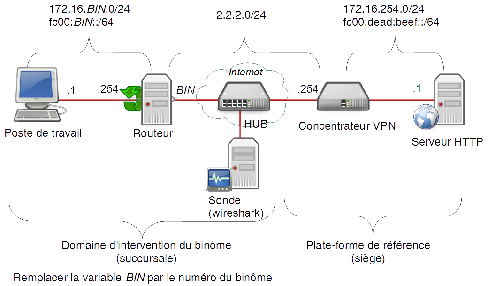
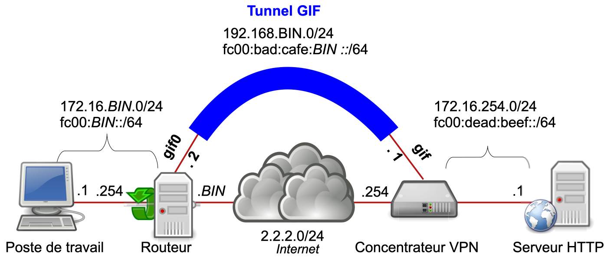
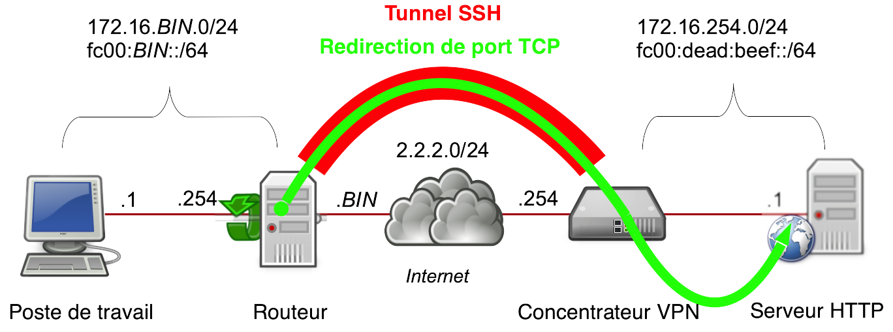
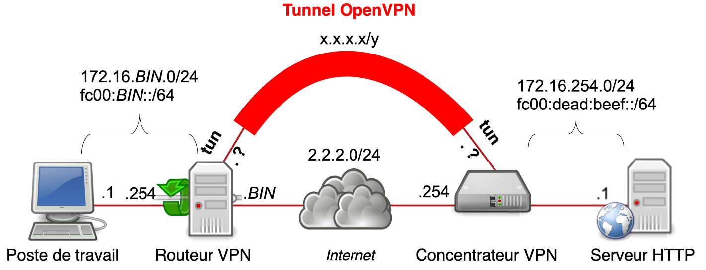

---
author:
- Olivier Cochard-Labbé
lang: fr
title: TP Réseau et Sécurité - IUT St Malo
---

Document non lisible sur smartphone (taille A4 minimum)

# Présentation du TP GIF, SSH et OpenVPN

Ce TP se découpe en plusieurs exercices du plus simple au plus complexe, tous présentant différentes méthodes pour mettre en place un VPN (interconnexion de réseau privé au-dessus d'un réseau public) :

1.  Mise en place de la maquette : permet de découvrir le paramétrage du système d'exploitation FreeBSD;
2.  Tunnel GIF pour de l'encapsulation IP dans IP sans chiffrage;
3.  Client SSH en redirection de flux TCP avec authentification par clés SSH;
4.  Configuration d'un serveur SSH et génération de clé SSH (exercice par paire de binôme) ;
5.  Configuration d'un client OpenVPN authentifié par certificats;
6.  Configuration d'un serveur OpenVPN et la création/répudiation de certificat (exercice par paire de binôme).

## Grille de notation

La notation de votre rapport se fera sur les critères suivants:

1.  La documentation de l'ensemble de vos actions (40%). Ce qui inclut la description des commandes passées pour la préparation de vos environnements, le nettoyage éventuellement nécessaire entre les différents exercices, les exercices eux-mêmes et vos résolutions de problèmes rencontrés;
2.  La réponse argumentée aux questions numérotées (60%);

Vous noterez qu'il est donc possible de réussir l'intégralité des exercices proposés, mais au final c'est uniquemement le contenu de votre rapport qui sera noté.

Concernant l'insertion de captures d'écrans qui sont fortement conseillées:

-   Elles seront au format bitmap (graphique) si la source de donnée est graphique (capture d'écran de l'environnement graphique des fenêtres Wireshark ou du navigateur);
-   Elles seront au format texte (simple copier/coller) si la source de donnée est le texte du terminal (vos commandes et leurs résultats, fichiers de configuration commentés, extraits de man page ou de fichiers de logs).

## Environnement simulé

L'environnement du TP simule le réseau du siège d'une entreprise reliée par VPN à ses succursales à travers un réseau public (ici Internet):


## FreeBSD

Ce TP utilise un système d'exploitation libre de la famille des Unix. L'avantage d'utiliser FreeBSD dans notre cas est sa simplicité de configuration (très peu de fichiers de configuration à modifier) ainsi que sa documentation très complète (pages man et guide utilisateur). De plus, la robustesse de sa pile IP et sa licence BSD en fait un système très couramment utilisé sur les équipements réseau tel que les routeurs et commutateurs (Juniper), firewalls (StormShield, pfSense, Netasq), NAS (NetApp, Isilon), serveurs CDN (Netflix OpenConnect) mais aussi consoles (Sony PlayStation, Nintendo Switch).

Particularité de FreeBSD pour les habitués à GNU/Linux : Le nom des périphériques (interfaces réseau, disques, etc.) est identifié par des noms liés aux drivers utilisés (bge0 pour la première carte Ethernet utilisant un pilote Broadcom, fxp0 pour une carte réseau Intel EtherExpress PRO/100, em0 pour des Intel Pro/1000, etc.).

Pour afficher la liste des interfaces réseau détectées, utilisez la commande `ifconfig` sans argument.

Voici la description de la sortie da la commande `ifconfig nom-interface`:

```
[etudiant@routeur]~>ifconfig em0
em0: flags=8843<UP,BROADCAST,RUNNING,SIMPLEX,MULTICAST> metric 0 mtu 1500 => État logique
     options=9b<RXCSUM,TXCSUM,VLAN_MTU,VLAN_HWTAGGING,VLAN_HWCSUM>        => Fonctionnalités activées
     ether 08:00:27:e3:9b:3f                                              => Adresse MAC
     inet6 fe80::a00:27ff:fee3:9b3f%em0 prefixlen 64 scopeid 0x1          => IPv6 link-local
     inet 2.2.2.15 netmask 0xffffff00 broadcast 2.2.2.255                 => Adresse IPv4
     inet6 fc00:10::254 prefixlen 64                                      => Autre IPv6
     nd6 options=3<PERFORMNUD,AUTO_LINKLOCAL>                             => Options ND IPv6
     media: Ethernet autoselect (1000baseT <full-duplex>                  => auto-négociation physique
     status: active                               => État physique de l'interface (présence d'un câble)
                                                     (Valide uniquement si l'interface est à l'état UP)
```
Voici quelques autres commandes qui vont vous être utiles pour
l'ensemble de ce TP:

-   Afficher la liste des routes : `netstat -rn`
-   Passer super-utilisateur (root) : `su -`
-   Afficher le manuel d'une commande : `man commande`
-   Afficher/modifier la liste des paramètres noyaux : `sysctl`
-   Afficher, en temps réel, un fichier : `tail -f /var/log/messages`
-   Afficher les dernières lignes d'un fichier : `tail /var/log/messages`
-   Désarchiver un fichier .tgz : `tar zxvf nom-du-fichier.tgz`

Pour plus d'information, se référer à la version anglaise (une traduction ne sera jamais à jour) du guide utilisateur sur **[www.freebsd.org/doc/en/books/handbook/](http://www.freebsd.org/doc/en/books/handbook/)**.

Sur la clé USB amorçable qui vous a été remise, vous y trouverez une installation standard de FreeBSD incluant les outils de base comme OpenSSH, `tcpdump`, `vi`, `ee` ainsi que les logiciels additionnels suivants :

-   OpenVPN;
-   mohawk: serveur web;
-   vim et nano: Éditeurs de texte supplémentaires;
-   w3m: navigateur web en mode texte (console).

Voici les paramètres de connexion pour se connecter à la console :

-   login du compte utilisateur : `etudiant`
-   mot de passe du compte utilisateur : `iut`
-   mot de passe du compte root : `stmalo`

*N'utiliser le compte « root » que quand c'est obligatoire, c'est-à-dire pour la modification de fichier de configuration système ou le lancement de daemon.*

### Éditeurs de texte

FreeBSD propose par défaut deux éditeurs de texte :

-   `vi` : Éditeur Unix classique mais complexe pour un débutant (si vous ne le connaissez pas, ne perdez pas de temps à le découvrir pendant ce TP) ;
-   `ee` (easy editor) : Éditeur plus simple qui convient mieux aux débutants.

Pour éditer un fichier texte avec ee, exécuter la commande
`ee mon-fichier.txt` pour se retrouver sur un écran séparé en 2 sections
haut/bas :
```
    ^[ (escape) menu  ^y search prompt  ^k delete line   ^p prev li   ^g prev page
    ^o ascii code     ^x search         ^l undelete line ^n next li   ^v next page
    ^u end of file    ^a begin of line  ^w delete word   ^b back 1 char
    ^t top of text    ^e end of line    ^r restore word  ^f forward 1 char
    ^c command        ^d delete char    ^j undelete char ^z next word
    =====line 1 col 0 lines from top 1 ============================================


    new file "mon-fichier.txt"
```

La première section du haut rappel la liste des commandes possibles. Par exemple elle indique que pour afficher le menu il faut appuyer sur la touche escape. Le caractère \^ indique de garder enfoncé la touche contrôle (Ctrl) pendant que vous appuierez sur la touche correspondante.
Par exemple, pour lancer la recherche d'un mot, c'est la combinaison Ctrl + y.

### Organisation de la configuration

L'organisation détaillée des dossiers est expliquée dans `man hier`:

-   L'ensemble de la configuration du système de base se trouve dans le dossier /etc;
-   La configuration des applications additionnelles (OpenVPN, easyrsa, vim, nano dans notre cas) se trouve dans le dossier /usr/local/etc.

Les paramètres globaux (nom de machine, adresses IP, routes par défaut et statiques, démarrage des services, etc.) seront a déclarer dans le fichier /etc/rc.conf. Pour découvrir les différentes options de ce fichier, inspirez-vous du fichier /etc/defaults/rc.conf qui contiens l'ensemble des paramètres par défaut ainsi que des exemples (mais ne jamais modifier ce fichier !). La configuration des paramètres spécifiques à certains daemons se fait dans leurs dossiers relatifs (/etc/ssh/sshd_config pour le serveur openssh par exemple).

### Présentation de la gestion de la configuration et des services par l'activation de sshd

Il est possible d'afficher et modifier le contenu du fichier /etc/rc.conf sans passer par un éditeur texte en utilisant la commande `sysrc` :

-   Ajoute ou modifie la variable dans /etc/rc.conf: `sysrc variable=valeur`
-   Active un service: `service NOM-DU-SERVICE enable`
-   Affiche la liste des variables modifiées: `sysrc -a`

Commencer par activer le daemon SSH :

1.  Ajouter la ligne `sshd_enable="YES"` dans le fichier /etc/rc.conf ou en utilisant la commande `service sshd enable`;
2.  Lancer le démarrage du service par la commande `service sshd start`.

Lors du lancement de celui-ci, il va générer différentes clés SSH pour lui-même et afficher l'empreinte de ces clés: Notez-les car elles vous seront demandées ultérieurement.

Les scripts de démarrage des services systèmes se trouvent dans /etc/rc.d et ceux des applications tierces (OpenVPN, mohawk) dans /usr/local/etc/rc.d. Il est possible d'afficher la liste complète des scripts RC disponibles par la commande `service -l` et d'afficher la liste des services activés par la commande `service -e`.

Remarques concernant quelques services systèmes particuliers :

-   Applique une création/modification d'interface réseau: `service netif restart`
-   Applique une modification de routes: `service routing restart`

## Interfaces virtuelles TUN et TAP

Une interface virtuelle est une interface logique qui dans notre cas sert à représenter les tunnels VPN.

# Exercice : Mise en place de la maquette

## Schéma complet

Voici le schéma logique de la maquette :



Note : Définissez un numéro de binôme (entre 1 et 20) unique entre vous. Aux adresses hôtes IPv4 notées .254, vous utiliserez l'équivalent visuel en IPv6 (par exemple l'adresse IPv6 interne du routeur binôme 20 est `fc00:20::254/64` et l'IPv4 : `172.16.20.254/24`).

## Votre environnement

Pour la réalisation de ce TP vous utiliserez 2 PCs :

-   Un premier PC avec 2 cartes réseau que vous démarrerez sur la clé USB fournie : Il jouera le rôle de PC « routeur VPN »;
-   Un second PC avec 2 cartes réseau qui jouera le rôle de PC « poste client et sonde ». Vous démarrerez ce PC sous Linux en prévoyant d'être capable d'y lancer un navigateur (pour les exercices « client SSH » et « client VPN ») ainsi qu'un serveur HTTP (pour les exercices « serveur SSH » et « serveur VPN »).


## Paramétrage initial du PC « poste de travail et sonde »

Nous allons commencer par le plus simple qui est le paramétrage IP du PC « poste de travail » :

1.  Identifier les interfaces Ethernet correspondantes à votre maquette;
2.  Configurer les adresses IP sur l'interface Ethernet reliée au «  PC routeur »;
3.  Déclarer la (les?) route(s) par défaut;
4.  Désactiver l'émission de requête IPv6 RA et AUTOCONF sur l'interface Ethernet utilisée comme sonde par les commandes
    `sysctl net.ipv6.conf.eth??.accept_ra=0` et `sysctl net.ipv6.conf.eth??.autoconf=0`;
5.  Lancer la capture de trafic sur l'interface Ethernet utilisée comme sonde ;

## Paramétrage du PC « routeur »

*Lisez l'ensemble de ce chapitre avant de commencer à manipuler.*

Pour paramétrer le PC « routeur » les tâches à effectuer sont celles-ci:

1.  Identifier les interfaces Ethernet correspondantes à votre maquette;
2.  Affecter les bonnes adresses IP sur les bonnes interfaces;
3.  Activer le routage IPv4 et IPv6 (ainsi que le daemon rtadvd pour IPv6);

L'identification des interfaces Ethernet peut-être réalisée en suivant cette méthode :

1.  Activer les interfaces Ethernet : `ifconfig INTERFACE up`;
2.  Débranchez physiquement tous les câbles Ethernet sauf un ;
3.  À l'aide de l'état des interfaces, champ status du résultat de la commande `ifconfig`, identifiez l'unique interface physique qui possède le status « active ».

Le paramétrage IP se résume simplement à déclarer les bonnes valeurs des bonnes variables dans le fichier /etc/rc.conf et à redémarrer les services impactés pour la prise en compte des changements. Voici la liste les variables utiles dans notre cas (inspirez-vous du fichier /etc/defaults/rc.conf pour connaître leur description et les valeurs à utiliser):
```
ifconfig_??="inet ??/??"
gateway_enable="??"
ipv6_activate_all_interfaces="YES"
ipv6_gateway_enable="??"
ifconfig_??_ipv6="inet6 ?? prefixlen ??"
rtadvd_enable="??"
rtadvd_interfaces="??"
```

Une fois le fichier modifié, relancez les services impactés :
```
service netif restart
service routing restart
service rtadvd restart
```

*\
Appelez-les tuteurs pour qu'ils valident l'état de votre maquette et qu'ils vous transfèrent vos clés SSH et certificats OpenVPN dans le dossier /home/etudiant/.*

# Exercice : Tunnel GIF - Encapsulation IP dans IP

Cette méthode utilise le protocole GIF (RFC2893 : encapsulation de datagramme IP dans IP sans chiffrement) pour créer un VPN :



Référez-vous à la man page GRE plutôt que celle de GIF pour les explications détaillées du concept d'encapsulation et de son paramétrage par la commande `man gre`. La déclaration d'une interface GIF se réalise avec ces deux lignes de configurations dans le fichier /etc/rc.conf:
```
cloned_interfaces="gif0"
ifconfig_gif0="inet INNER-LOCAL-IP INNER-REMOTE-IP tunnel OUTER-LOCAL-IP OUTER-REMOTE-IP up"
ifconfig_gif0_ipv6="???"
```
Ne pas oublier la déclaration des routes statiques pour atteindre le
réseau du siège.

Une fois le paramétrage IP terminé, à partir du navigateur du PC « poste
de travail », il est possible de joindre les URL suivantes:

-   [http://172.16.254.1](http://172.16.254.1)
-   [http://[fc00:dead:beef::1]](http://[fc00:dead:beef::1])

*\Appelez-les tuteurs pour qu'ils valident l'état de votre maquette.*

# Exercice : Client SSH - Protection de flux TCP

*Détruire les interfaces GIF si elles sont actives avant de réaliser les exercices OpenVPN.*

Cet exercice présente une première utilisation de SSH par la protection de flux TCP. L'administrateur réseau du siège a réalisé deux actions :

1.  Il a créé un compte utilisateur (login : succursale_BIN, mot de passe : BIN) sur le concentrateur VPN du siège;
2.  Il vous a transmis une archive (succursale_BIN_cles.tgz) contenant les clés SSH (privée et publique) et certificat OpenVPN de l'utilisateur ainsi que l'empreinte SSH de la clé du concentrateur VPN (dans le dossier /home/etudiant).

*Rappel : Ne travaillez sous le compte root que quand c'est ABSOLUMENT
utile.*\
Désarchiver votre archive contenant les clés SSH.

Voici le principe de la redirection d'un port TCP dans une session SSH :



Le PC « routeur » va lancer un tunnel SSH à destination du Concentrateur SSH/VPN et permettre de rediriger le trafic TCP à destination de son propre port 8080, vers le port 80 du serveur HTTP à travers ce tunnel SSH. Pour activer cette redirection de port, vous allez à partir du PC « routeur SSH/VPN » :

1.  Vérifiez que vous travaillez bien sous le compte simple utilisateur et non pas root;
2.  Protéger votre clé privé pour que personne d'autre que votre utilisateur ne puisse y accéder par la commande `chmod 600 id_rsa`. Le client SSH vérifiera les droits d'accès et refusera d'utiliser une clé dont les permissions d'accès ne sont pas assez restrictives;
3.  Lancer la commande suivante (sur une seule ligne) : `ssh -N -L8080:172.16.254.1:80 -g -i /chemin/votre.clé ssh succursale_BIN@2.2.2.254`
4.  Puis vérifier le fonctionnement en lançant un navigateur à partir de votre PC « poste de travail » à destination de votre routeur SSH/VPN sur son port 8080 : <http://172.16.BIN.254:8080> et/ou [http://[fc00:BIN::254]:8080](http://[fc00:BIN::254]:8080){.uri}

*\
Appelez-les tuteurs pour qu'ils valident l'état de votre maquette.*

# Exercice : Serveur SSH -- Protection de flux TCP

Votre rôle est désormais de mettre en place un serveur OpenSSH pour permettre l'accès sécurisé à vos ressources. pour cela vous réaliserez les actions suivantes:

1.  Activer un serveur HTTP sur votre « poste de travail » (qui jouera le rôle de serveur HTTP pour cet exercice);
2.  Créer un compte utilisateur ainsi que les clés SSH correspondantes sur votre routeur VPN;
3.  Transmettre à votre binôme voisin par la commande `scp` les clés SSH.

## Création d'un compte utilisateur et de ses clés SSH

Passer super-utilisateur « root » pour pouvoir créer un compte
utilisateur par la commande `adduser` puis générer le couple de clé SSH
par la commande `ssh-keygen -f utilisateur.cle.ssh`. Notez ensuite
l'empreinte de la clé avec la commande `ssh-keygen -l`. Ajoutez la clé
publique de l'utilisateur au fichier
/home/UTILISATEUR/.ssh/authorized_keys (ce fichier est le porte-clés
public des utilisateurs autorisés à se connecter) par les commandes :

1.  `mkdir /home/UTILISATEUR/.ssh`
2.  `cat clé-publique >> /home/UTILISATEUR/.ssh/authorized_keys`.

Attention : Les droits d'accès au fichier authorized_keys doivent être
strictement limités en écriture à l'utilisateur pour que le daemon SSHd
accepte d'utiliser les clés publiques qui y sont stockées. Pour
appliquer ces restrictions, utiliser la commande
`chmod 644 /home/UTILISATEUR/.ssh/authorized_keys`

Transmettez les deux clés à votre binôme voisin par scp (attention à la
syntaxe: la commande se termine par deux points!) par la commande
`scp NOM-DU-FICHIER etudiant@IP:`

Puis vérifiez que votre voisin a bien reçu ses deux clés.

## Protection de flux TCP (redirection de port dans une session SSH)

Modifier la configuration de votre serveur SSH (/etc/ssh/sshd_config)
pour :

1.  Désactiver la résolution DNS pour éviter d'attendre le timeout de cette résolution lors de la connexion (UseDNS no);
2.  Augmenter le niveau de détail des journaux (LogLevel DEBUG) pour diagnostiquer d'éventuel problème (/var/log/debug.log).

N'oubliez pas de redémarrer le service sshd suite à la modification de
la configuration. Puis vérifier que le binôme voisin accède bien à vos
ressources en utilisant la redirection de port : Si un mot de passe
autre que celui de la clé privée SSH est demandé, cela veut dire que
l'authentification par clé SSH ne fonctionne pas !\
\
*Appelez-les tuteurs pour qu'ils valident l'état de votre maquette.*

# Exercice : Client OpenVPN -- Protection de flux IP

Dans cet exercice votre routeur montera un tunnel OpenVPN vers le concentrateur VPN:



*Détruire les interfaces GIF si elles sont actives avant de réaliser les exercices OpenVPN.*

Pour le paramétrage du client VPN, vous trouverez les certificats
OpenVPN dans l'archive transmise par le siège en même temps que les clés
SSH.\

Paramétrez le PC « routeur » comme client OpenVPN:

1.  Créer le dossier /usr/local/etc/openvpn/;
2.  Copiez l'ensemble des certificats OpenVPN qui vous ont été remis
    dans le dossier /usr/local/etc/openvpn;
3.  Inspirez-vous du fichier de configuration d'exemple de client OpenVPN
    /usr/local/share/examples/openvpn/sample-config-files/client.conf
    pour créer le fichier de configuration
    /usr/local/etc/openvpn/succursale.BIN.conf

Les paramètres nécessaires à la configuration de votre client openvp sont les suivants :

-   Type de service OpenVPN : client
-   Type d'interface virtuelle à utiliser : tun
-   Adresse IP du serveur OpenVPN (remote) : cf le schéma
-   Nom du fichier correspondant au certificat du CA
-   Nom du fichier correspondant à votre certificat « client »
-   Nom du fichier correspondant à votre clé « client »
-   Le niveau de détail des logs : 4

Une fois le fichier de configuration terminé, lancez le client OpenVPN
par la commande `openvpn /usr/local/etc/openvpn/succursale.BIN.conf`

Vérifiez qu'une nouvelle interface virtuelle a été crée suite au
lancement d'OpenVPN.

Vérifiez ensuite que vous avez accès au serveur Web du siège et mettez
en évidence le chiffrage du flux HTTP par votre sonde.\
*Appelez-les tuteurs pour qu'ils valident l'état de votre maquette.*

# Exercice : Serveur OpenVPN -- Protection de flux IP

## Les 2 principaux usages d'un tunnel VPN

Le premier usage d'un tunnel VPN est de connecter un poste nomade aux ressources internes de l'entreprise. Il s'agit du paramétrage le plus simple d'OpenVPN et c'est celui indiqué dans les fichiers d'exemples:


Vous remarquerez que cette utilisation ne répond pas exactement à notre
besoin qui est plus complexe : Nous souhaitons interconnecter 2 réseaux
IP entre eux et pas simplement donner l'accès à un poste nomade. Nous
devons donc paramétrer le serveur OpenVPN pour identifier le site qui se
connecte (en utilisant l'attribue « Common Name » du certificat SSL qui
est unique pour chaque client) pour pouvoir installer les routes
correspondantes aux réseaux IP de ce client :


## Génération des certificats

Cet exercice va vous demander de créer votre propre autorité de certification et donc de générer votre fichier ca.crt : Attention de ne pas mélanger ce nouveau avec celui de l'exercice précédent car ils portent le même nom. De plus, lors de la copie scp, vérifiez que vous n'écrasez pas un fichier déjà existant sur la machine du binôme voisin.

Générer les répertoires de clé avec la commande `easyrsa init-pki`.
Cette commande va créer le répertoire /usr/local/share/easy-rsa/pki qui contiendra l'ensemble des certificats que vous allez créer.

Lancer le pré calcul des données pour l'algorithme de Diffie-Hellman qui servira à l'échange de clefs par la suite par la commande `easyrsa gen-dh`.

Puis exécutez le script `easyrsa build-ca nopass` et examinez le contenu du répertoire /usr/local/share/easy-rsa/pki/.

Exécutez le script `easyrsa build-server-full NOM-DE-VOTRE-ROUTEUR nopass` puis examinez le contenu du répertoire pki/.

Vous allez maintenant générer un certificat client par la commande `easyrsa build-client-full BINOME-? nopass` avec ? correspondant au numéro du binôme voisin. Puis recopiez les fichiers ca.crt, dh.pem, issued/NOM-DE-VOTRE-ROUTEUR.crt et private/NOM-DE-VOTRE-ROUTEUR.key dans le répertoire /usr/local/etc/openvpn/. Transmettez les certificats utilisateurs (BINOME-?.crt, BINOME-?.key et ca.crt) au binôme voisin par scp.

## Paramétrage d'OpenVPN

Inspirez-vous des exemples /usr/local/share/examples/openvpn/sample-config-files/ et plus particulièrement des fichiers server.conf et client.conf pour créer votre fichier /usr/local/etc/openvpn/openvpn.conf. La section « Expanding the scope of the VPN to include additional machines on either the client or server subnet » du HOW TO d'OpenVPN peux vous donner des informations supplémentaires ([www.openvpn.net/index.php/open-source/documentation/howto.html#scope](www.openvpn.net/index.php/open-source/documentation/howto.html#scope)).
Concernant le paramétrage IPv6, les variables à utiliser sont détaillées sur **www.greenie.net/ipv6/openvpn.html**.

Les paramètres obligatoires minimums au fonctionnement du daemon OpenVPN sont les suivants:

-   Rôle et subnet à utiliser pour les tunnels eux-mêmes: `server TUNNEL-SUBNET TUNNEL-MASK` (variables à remplacer);
-   Type d'interface virtuelle à utiliser: tun;
-   Nom du fichier correspondant au certificat du CA;
-   Nom du fichier correspondant à votre certificat « serveur »;
-   Nom du fichier correspondant à votre clé « serveur »;
-   Nom du fichier qui contient les paramètres DH;
-   Route à « pousser » sur les clients lors de leur connexions (subnet coté serveur);
-   Nom du dossier où sont stockés les fichiers de spécification de chaque client. Dans ce dossier sera créé un fichier par client qui porte le même nom que le common-name du certificat client et ne contient qu'une déclaration : L'adresse réseau du client;
-   Routes vers les sites distants (ce sont les mêmes que dans les fichiers de l'étape précédente);
-   (optionnel) Le niveau de détail des logs: 4;

Lancer le service en ajoutant la ligne `openvpn_enable="yes"` au fichier /etc/rc.conf suivis d'un `service openvpn start`. Utilisez les messages du fichier /var/log/messages pour résoudre vos problèmes.

Demandez au binôme voisin de s'y connecter, puis une fois connecté vérifiez qu'il accède à votre serveur web.

*Appelez-les tuteurs pour qu'ils valident l'état de votre maquette.*
